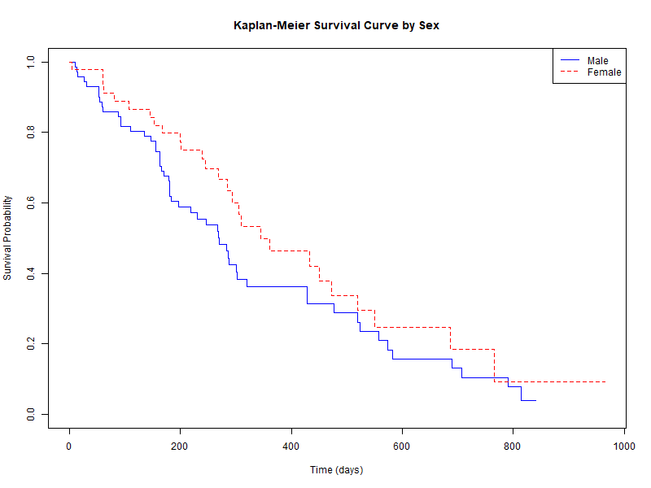
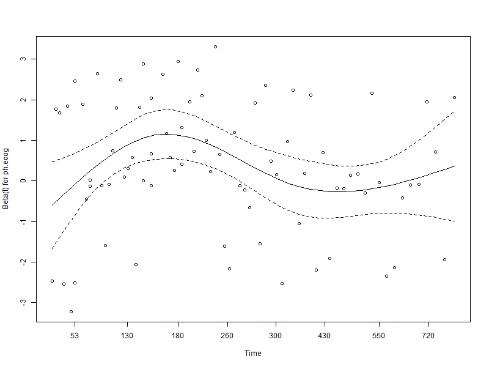
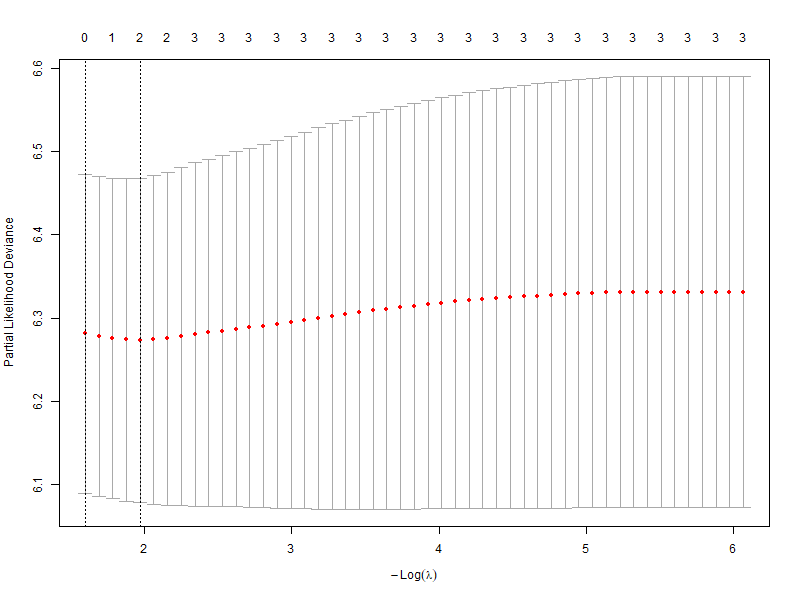
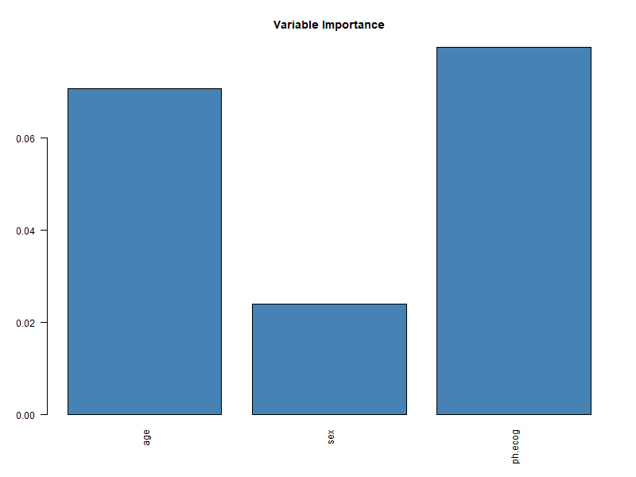

# Clinical Survival Prediction

This project explores statistical and machine learning approaches for clinical survival prediction using time-to-event data in R.

The analysis uses the `lung` dataset from the `survival` package and focuses on comparing interpretable statistical survival models with more flexible predictive machine learning methods.

The project was developed as part of a broader interest in predictive modelling, statistical learning, and applied quantitative research using real-world datasets.

## Methods

The workflow includes:

- Kaplan–Meier survival estimation
- Log-rank testing
- Cox proportional hazards modelling
- Penalized Cox regression (LASSO)
- Random Survival Forests
- Concordance-based model evaluation
- Train/test split validation

The analysis also includes:
- proportional hazards diagnostics,
- variable importance analysis,
- and reproducible modelling workflows in R.

## Dataset

The project uses the `lung` dataset available in the R `survival` package.

Variables include:
- survival time,
- censoring status,
- age,
- sex,
- ECOG performance score.

## Key Findings

- ECOG performance score showed a strong association with mortality risk.
- Cox models provided interpretable estimates of covariate effects.
- Random survival forests improved modelling flexibility for non-linear relationships.
- Penalized regression supported regularized predictive modelling and variable selection.
- Validation workflows highlighted the importance of evaluating generalizability in survival prediction.

## Visualisations

### Kaplan–Meier Survival Curve

### Proportional Hazards Diagnostics

### LASSO Cross-Validation

### Random Survival Forest Variable Importance

## Tools

### Programming Language
- R

### Packages
- survival
- glmnet
- randomForestSRC

## Repository Contents

- `clinical_survival_prediction.R` — full analysis workflow
- `figures/` — generated visualisations
- `README.md` — project overview and methodology

## Author

**Mayuri Chatterjee**  
PhD Researcher in Statistics  
Stockholm University
